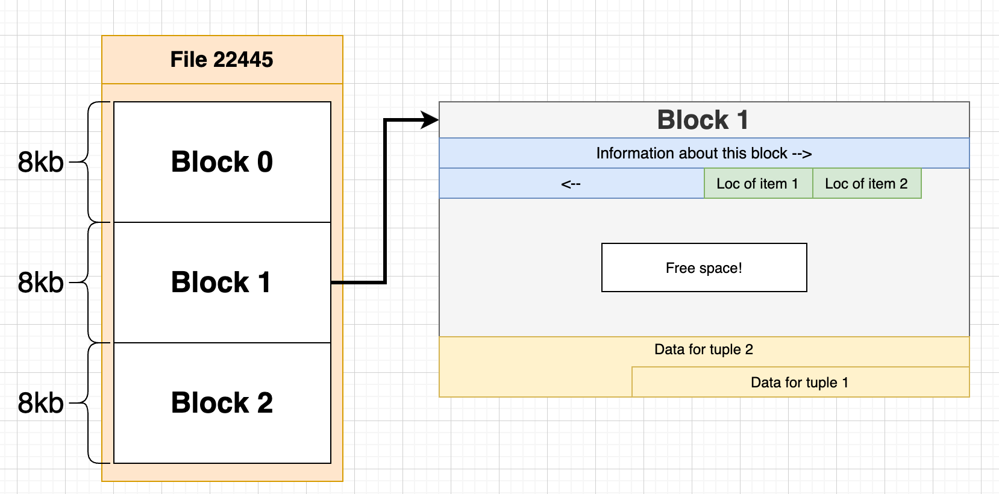
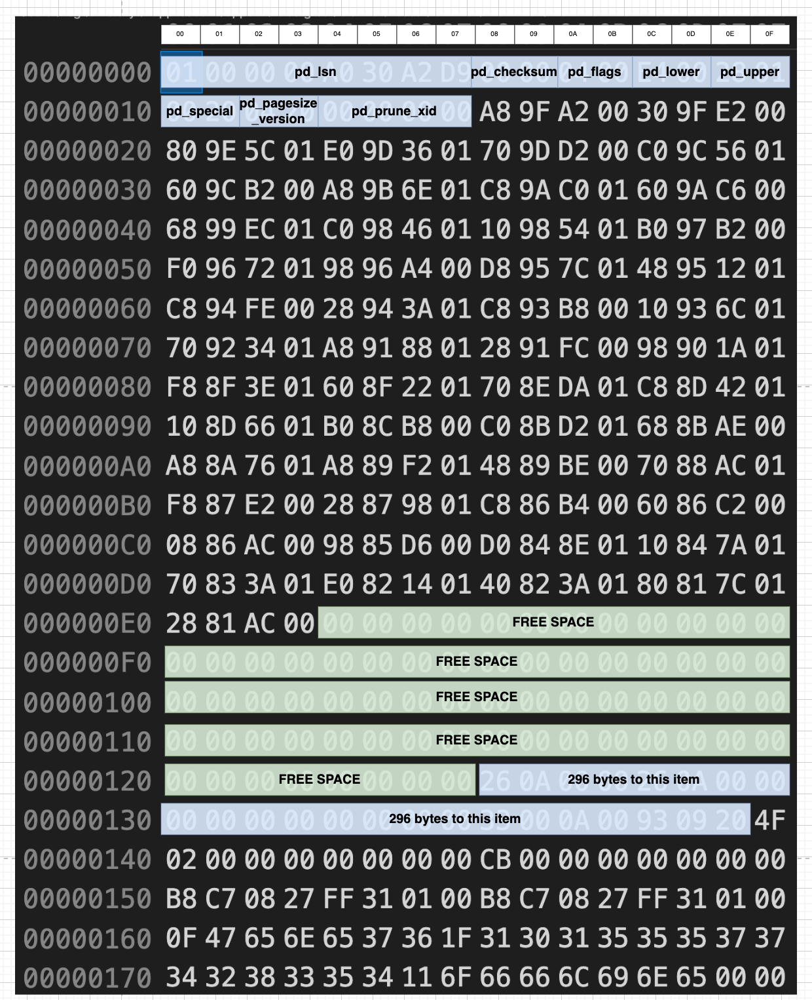
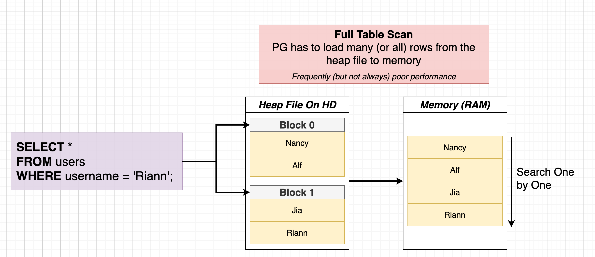
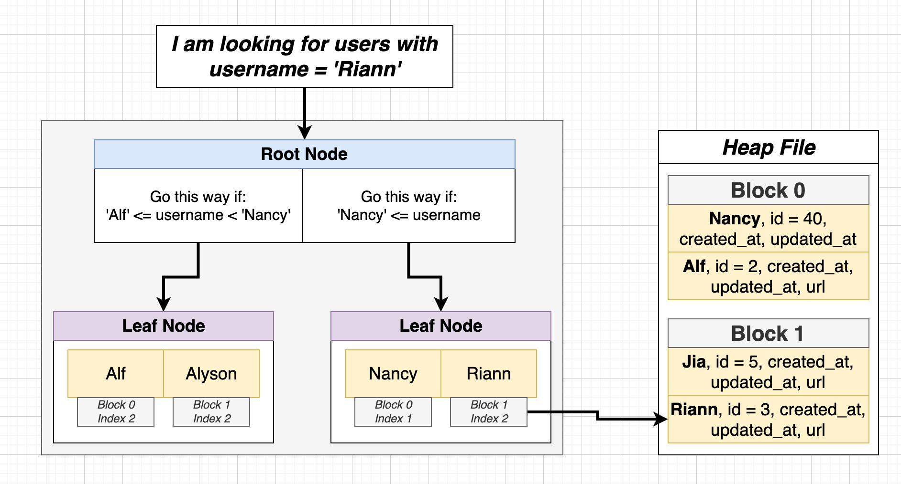
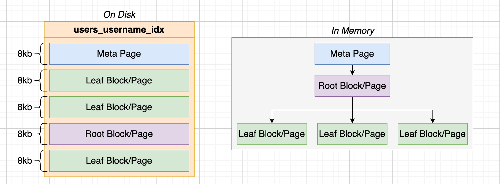
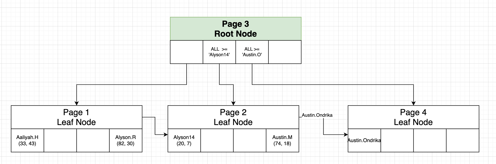
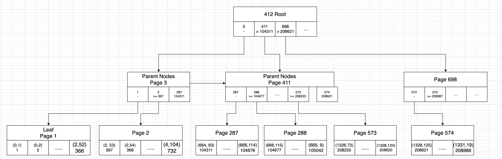

# Where Postgres Store data?
```sql
SHOW data_directory;


-- Go to /path-to-show-directory/base/<oid>

SELECT oid, datname
FROM pg_database;


-- To see specific file contents check via below command.
SELECT *
FROM pg_class;
```

**Heap or Heap File**: File that contains all the data (rows) of our table.
**Tuple or Item:** Individual row from table.
**Block or Page:** The heap file is divided into many different 'blocks' or 'pages'. Each page/block stores some number of rows.

So the whole file like `22445` is called Heap file.
the file is divided into `8Kb` of data. Each 8kb data is called Block/Page.

In each Block/Page, we have many row i.e. tuple/Item like User#203 etc.






# How postgres run a query

First it load all rows in ram, then sequentially search one by one which
is called full table scan



Full table scan is always poor performance wise ie. take more time to load entire
rows in RAM then search one by one. It would be better if we run
```sql
SELECT *
FROM users
WHERE username = "Riann";
```
Instead of loading the whole rows in RAM, if someone tells us that Riann User
is in Block 1, Index 2, then we can only load block 1.

That is called Index -> Which is a data structure tells us what block/index a
record is stored at

Suppose we want to index our `username` field of users table.
1. First it will take all users's username with info like Block X and Index Y.
2. It will sort the usernames in meaningful order like for text alphabetical order and for number by value.
3. Then plot the data in tree data structure ie. Evenly distribute values in the leaf nodes, in order left to right.
4. Add Helpers in the root node i.e Go this way if 'Alf' <= username < 'Nancy', ...



### Create an Index

```sql
CREATE INDEX ON users (username);

-- or with name
CREATE INDEX username_index ON users (username);
```

### Delete an Index

```sql
DROP INDEX users_username_idx;
```

### Benchmarking before vs after index
```sql
EXPLAIN ANALYZE SELECT *
FROM users
WHERE username = 'Emil30'
```
Without Index: Execution Time: 0.879 ms
With Index: 0.119ms
So almost 7 times faster with index.

### Downside of index

- Can be large! Stores data from at least one column of the real table

```sql
SELECT pg_size_pretty(pg_relation_size('users')); -- 872KB
SELECT pg_size_pretty(pg_relation_size('users_username_idx')); -- 184KB
```

- Slows down insert/update/delete - the index has to be updated!
- Index might not actually get used!


# Index Types
- B-Tree: General purpose index 99% of the time you want this. When we use `CREATE INDEX...` command this index is getting created.
- Hash: Speeds up simple equality checks
- GiST: Geometry, full text search
- SP-GiST: Clustered data, such as dates - many rows might have the same year
- GIN: For columns that contain arrays or JSON data
- BRIN: Specialized for really large datasets

# Automatically created index
- Postgres automatically creates an index for the primary key column of every table.
- Postgres automatically creates an index for any 'unique' constraint.
- These don't get listed under 'indexes' in PGAdmin!

List down all indexes.
```sql
SELECT relname, relkind
FROM pg_class
WHERE relkind = 'i';
```

# How index stored behind the scene?
Each index is stored in a file inside hard disk with the following information:



Enable pageinspect for some extra features.
```sql
CREATE EXTENSION pageinspect;
```

```sql
SELECT *
FROM bt_metap('users_username_idx');
```

```json
{
  "magic": 340322,
  "version": 4,
  "root": "3",
  "level": "1",
  "fastroot": "3",
  "fastlevel": "1",
  "last_cleanup_num_delpages": "0",
  "last_cleanup_num_tuples": -1,
  "allequalimage": true
}
```
root position is in 3.

```sql
SELECT *
FROM bt_page_items('users_username_idx', 3);
```
```json
{
  "itemoffset": 1,
  "ctid": "(1,0)",
  "itemlen": 8,
  "nulls": false,
  "vars": false,
  "data": "",
  "dead": null,
  "htid": null,
  "tids": null
}
```
`ctid=(1,0)` mean it is the stored in 1st leaf node.

go to 1st leaf node
```sql
SELECT *
FROM bt_page_items('users_username_idx', 1);
```
```json
{
  "itemoffset": 2,
  "ctid": "(33,43)",
  "itemlen": 24,
  "nulls": false,
  "vars": true,
  "data": "1d 41 61 6c 69 79 61 68 2e 48 69 6e 74 7a 00 00",
  "dead": false,
  "htid": "(33,43)",
  "tids": null
}
```
Here in leaf node, the (33, 43) mean the item is inside 33th page and 43th index.

```sql
SELECT ctid, * FROM users WHERE username = 'Aaliyah.Hintz';
```
```json
{
  "ctid": "(33,43)",
  "id": 1655,
  "created_at": "2014-05-17 08:59:35.014+05:30",
  "updated_at": "2014-05-17 08:59:35.014+05:30",
  "username": "Aaliyah.Hintz",
  "bio": "Neque eum minima omnis.",
  "avatar": "https://s3.amazonaws.com/uifaces/faces/twitter/levisan/128.jpg",
  "phone": null,
  "email": "Gaston_Hartmann@gmail.com",
  "password": "D78Q2eaWM_nMbf_",
  "status": "offline"
}
```

First leaf node's first row of the below query denotes next leaf node's first item's pointer.

```sql
SELECT *
FROM bt_page_items('users_username_idx', 1);
```
```json
{
  "itemoffset": 1,
  "ctid": "(20,1)",
  "itemlen": 24,
  "nulls": false,
  "vars": true,
  "data": "13 41 6c 79 73 6f 6e 31 34 00 00 00 00 00 00 00",
  "dead": null,
  "htid": null,
  "tids": null
}
```

Where is the index file?
```sql
SELECT oid, relname FROM pg_class where relkind = 'i';
```

```json
{
  "oid": 17148,
  "relname": "users_username_idx"
}
```

If we have more and more record, then in index it will be one root then some parent nodes which is child node of root then some leaf node under parent node for efficiency.


