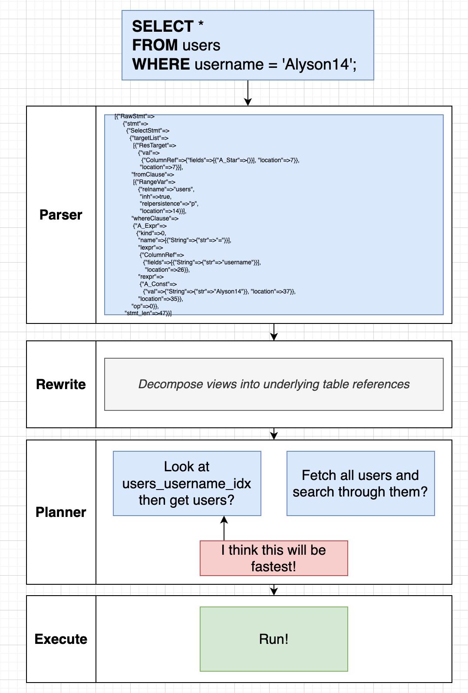
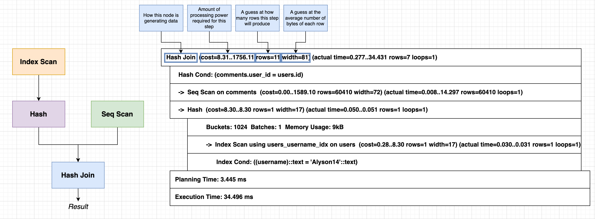

# How SQL run behind the scene?

First parser will parse the sql then postgresql will rewrite certain part for
optimization, then Planner will check if any index etc needs to be taken care of
finally execute the query.



# Planning SQL query

Explain: Build a query plan and display info about it.

Explain Analyze: Build a query plan, run it, and info about it.

These are benchmarking + evaluating queries, not for use in real data fetching.

```sql
SELECT username, contents
FROM users
JOIN comments ON comments.user_id = users.id
WHERE username = 'Alyson14';

EXPLAIN SELECT username, contents
FROM users
JOIN comments ON comments.user_id = users.id
WHERE username = 'Alyson14';

EXPLAIN ANALYZE SELECT username, contents
FROM users
JOIN comments ON comments.user_id = users.id
WHERE username = 'Alyson14';
```

`EXPLAIN` command tells info about the query plan without executing it.
`EXPLAIN ANALYZE` also tells us query plan, execute it and shows statistics about the execution.


How postgresql know how many rows are there in a table without running the query using `EXPLAIN`?

Postgres actually keep a track of stats in `pg_stats` table.

```sql
SELECT *
FROM pg_stats
WHERE tablename = 'users';
```




```
Hash Join  (cost=8.31..1795.11 rows=11 width=81) (actual time=0.093..11.555 rows=7 loops=1)
```
Here 8.31 is cost for this particular step for first row, and 1795.11 is cost for all the rows of this particular step.


```sql
EXPLAIN SELECT *
FROM likes
WHERE created_at < '2013-01-01';
```

```sql
CREATE INDEX likes_created_at_idx ON likes (created_at);
```

```sql
EXPLAIN SELECT *
FROM likes
WHERE created_at < '2013-01-01';
```
It is doing index scan.


```sql
EXPLAIN SELECT *
FROM likes
WHERE created_at > '2013-01-01';
```
It is doing a sequential scan. Why is that as we have index?
Because we are fetching 688060 which is very large amount of time ie. 70% of the whole count, that is why sequential scanning is faster, as index access is more costly for this large amount of time.
